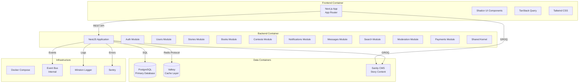

# C4 Level 2: Container Diagram
## Hakawi - Technical Building Blocks

---

## Container Diagram

---

## Frontend Container

### Next.js Application
- **Technology:** Next.js 14 with App Router
- **Language:** TypeScript
- **Styling:** Tailwind CSS + Shadcn UI
- **State Management:** TanStack Query + Server Components
- **Features:**
  - Server-side rendering (SSR)
  - Static site generation (SSG)
  - API routes (minimal)
  - PWA support (future)

### Key Components
| Component | Purpose | Technology |
|-----------|---------|------------|
| **App Router** | Routing and layouts | Next.js App Router |
| **Shadcn UI** | UI component library | Radix UI + Tailwind |
| **TanStack Query** | Server state management | React Query |
| **Tailwind CSS** | Styling | Utility-first CSS |

---

## Backend Container

### NestJS Application
- **Technology:** NestJS (Node.js + TypeScript)
- **Architecture:** Modular monolith
- **API Style:** REST
- **Features:**
  - Dependency injection
  - Guards and interceptors
  - Validation pipes
  - Exception filters
  - Swagger/OpenAPI docs

### Modules

| Module | Responsibility | Dependencies |
|--------|---------------|--------------|
| **Auth** | Authentication, authorization | Users, Permissions |
| **Users** | User management, profiles | Database, Cache |
| **Stories** | Story CRUD, publishing | Sanity, Database |
| **Books** | Book sales, rentals | Payments, Database |
| **Contests** | Contest management | Users, Stories |
| **Notifications** | In-app notifications | Database, Cache |
| **Messages** | Direct messaging | Database |
| **Search** | Full-text search | Database, Sanity |
| **Moderation** | Content moderation | Database, WAF |
| **Payments** | Payment processing | Paymob, Database |

---

## Data Containers

### PostgreSQL
- **Technology:** PostgreSQL 15+
- **ORM:** Drizzle ORM
- **Purpose:** Primary data store for relational data
- **Data:** Users, interactions, transactions, notifications, messages, reports

### Valkey
- **Technology:** Valkey (Redis-compatible)
- **Purpose:** Caching layer
- **Features:**
  - Session cache
  - Rate limiting
  - WAF state
  - Query result cache

### Sanity CMS
- **Technology:** Sanity.io
- **Purpose:** Story content management
- **Features:**
  - Rich text editing
  - Media management
  - GROQ queries
  - Real-time collaboration

---

## Infrastructure

### Docker Compose
- **Purpose:** Local development orchestration
- **Services:**
  - PostgreSQL
  - Valkey
  - Adminer (DB management)

### Event Bus
- **Technology:** EventEmitter2 (lightweight)
- **Purpose:** Internal event-driven communication
- **Events:** UserCreated, StoryPublished, ContestCreated, etc.

### Logger
- **Technology:** Winston
- **Purpose:** Structured logging
- **Features:**
  - Log levels
  - Correlation IDs
  - JSON output

### Sentry
- **Purpose:** Error tracking and monitoring
- **Features:**
  - Error aggregation
  - Performance monitoring
  - Release tracking

---

## Communication Patterns

### Synchronous
- Frontend → Backend: REST API calls
- Backend → PostgreSQL: SQL queries via Drizzle
- Backend → Valkey: Redis protocol
- Backend → Sanity: GROQ queries

### Asynchronous
- Backend → Event Bus: Internal events
- Backend → Email: SMTP/API
- Backend → Sentry: Error reports

---

## Scalability Considerations

- **Frontend:** CDN, edge caching
- **Backend:** Horizontal scaling (stateless)
- **Database:** Read replicas, connection pooling
- **Cache:** Valkey cluster (future)
- **Sanity:** Managed service (auto-scaling)

---

*This document defines the container architecture for Hakawi.*
