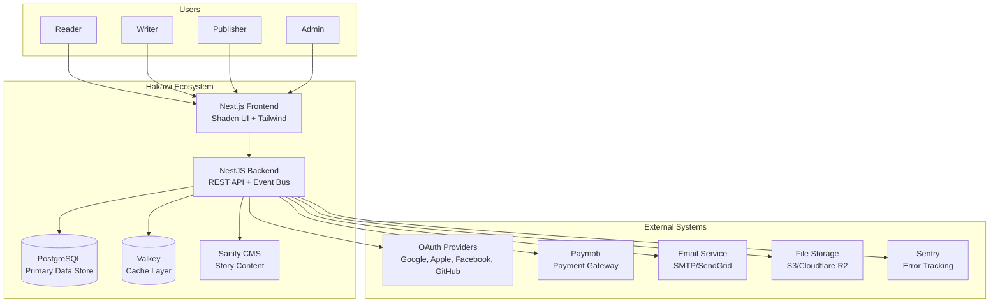

# C4 Level 1: System Context
## Hakawi - High-Level System View

---

## System Context Diagram



---

## Actors

### Primary Actors

| Actor | Description | Access Level |
|-------|-------------|--------------|
| **Reader** | Consumes stories and books | Read-only access to published content |
| **Writer** | Creates and publishes stories | Read + write access to own content |
| **Publisher** | Creates and manages contests | Read + write + contest management |
| **Admin** | Platform administration | Full system access |

### Secondary Actors

| Actor | Description | Access Level |
|-------|-------------|--------------|
| **Guest** | Unauthenticated user | Limited read access |
| **Moderator** | Content moderation | Read + moderation actions |
| **System** | Automated processes | Background jobs, sync services |

---

## External Systems

| System | Purpose | Integration Type |
|--------|---------|------------------|
| **OAuth Providers** | Authentication | OAuth 2.0 / OpenID Connect |
| **Paymob** | Payment processing | REST API + Webhooks |
| **Email Service** | Notifications, verification | SMTP / API |
| **File Storage** | Media files, PDFs | S3-compatible API |
| **Sentry** | Error tracking | SDK integration |
| **Valkey** | Caching | Redis-compatible protocol |
| **Sanity CMS** | Story content management | GROQ API |

---

## System Boundaries

### Hakawi System
- **Frontend:** Next.js application
- **Backend:** NestJS REST API
- **Data:** PostgreSQL, Valkey, Sanity

### External Boundaries
- **Identity:** OAuth providers
- **Payments:** Paymob gateway
- **Communication:** Email service
- **Observability:** Sentry

---

## Key Interactions

### User Authentication Flow
```
User → Frontend → Backend → OAuth Provider
                          ↓
                    JWT Token
                          ↓
                    Frontend ← Backend
```

### Story Publishing Flow
```
Writer → Frontend → Backend → Sanity CMS
                          ↓
                    PostgreSQL Mirror
```

### Payment Flow
```
User → Frontend → Backend → Paymob
                          ↓
                    Webhook
                          ↓
                    PostgreSQL (Transaction)
```

---

## Constraints

- **Arabic-first:** RTL support required
- **Multi-tenant:** Single database, multi-user
- **Real-time:** Notifications, messages
- **Offline:** PWA capabilities (future)

---

*This document defines the system context for Hakawi.*
