# Module Boundaries
## Hakawi - Module Contracts and Dependencies

---

## Module Organization

Hakawi follows a **modular monolith** architecture where each business domain is encapsulated in its own module. Modules communicate through well-defined interfaces and events.

---

## Module Dependency Graph

```mermaid
graph TB
    subgraph "Core Modules"
        Auth[Auth Module]
        Users[Users Module]
    end

    subgraph "Content Modules"
        Stories[Stories Module]
        Series[Series Module]
        Playlists[Playlists Module]
        Books[Books Module]
    end

    subgraph "Social Modules"
        Notifications[Notifications Module]
        Messages[Messages Module]
        Follows[Follows Module]
        Reactions[Reactions Module]
        Comments[Comments Module]
    end

    subgraph "Business Modules"
        Contests[Contests Module]
        Payments[Payments Module]
        Search[Search Module]
        Moderation[Moderation Module]
    end

    subgraph "Shared Kernel"
        Database[(Database)]
        Cache[(Cache)]
        Events[Event Bus]
        Security[Security]
    end

    Auth --> Database
    Users --> Database

    Auth --> Cache
    Users --> Cache
    Stories --> Cache
    Notifications --> Cache

    Auth --> Events
    Users --> Events
    Stories --> Events
    Books --> Events
    Contests --> Events
    Notifications --> Events

    Auth --> Security
    Users --> Security
    Stories --> Security
    Books --> Security
```

---

## Module Contracts

### Auth Module

**Purpose:** Authentication and authorization

**Public Interface:**
- `POST /auth/register` - Register new user
- `POST /auth/login` - Login user
- `POST /auth/refresh` - Refresh access token
- `POST /auth/logout` - Logout user
- `GET /auth/session` - Get current session
- `POST /auth/mfa` - MFA verification

**Dependencies:**
- **None** — Auth is a foundational module with no dependencies on other business modules
- Cache (session storage)
- Event Bus (user events)

**Events Published:**
- `user.registered`
- `user.logged_in`
- `user.logged_out`

**Events Consumed:**
- None

**Note:** Auth module does NOT depend on Users module. User creation happens within Auth module during registration. The Users module extends user data but does not own authentication.

---

### Users Module

**Purpose:** User profiles, statistics, and extended user data

**Public Interface:**
- `GET /users/:id` - Get user profile
- `PATCH /users/:id` - Update user profile
- `GET /users/:id/stats` - Get user statistics
- `POST /users/:id/verify` - Request verification

**Dependencies:**
- **None** — Users module does not depend on Auth module
- Cache (profile cache)
- Event Bus (user events)

**Events Published:**
- `user.updated`
- `user.verified`

**Events Consumed:**
- `user.registered` (send welcome notification, initialize user stats)

**Note:** Users module does NOT depend on Auth module. It reacts to `user.registered` event to initialize user data. Authentication is handled entirely by Auth module.

---

### Stories Module

**Purpose:** Story CRUD and publishing

**Public Interface:**
- `GET /stories/:id` - Get story
- `POST /stories` - Create story
- `PATCH /stories/:id` - Update story
- `DELETE /stories/:id` - Delete story
- `POST /stories/:id/publish` - Publish story
- `GET /stories` - List stories

**Dependencies:**
- Users Module (author)
- Sanity CMS (content)
- Search Module (indexing)
- Notifications Module (notify followers)

**Events Published:**
- `story.created`
- `story.updated`
- `story.published`
- `story.deleted`

**Events Consumed:**
- None

---

### Books Module

**Purpose:** Book sales and rentals

**Public Interface:**
- `GET /books/:id` - Get book
- `POST /books` - Create book
- `PATCH /books/:id` - Update book
- `DELETE /books/:id` - Delete book
- `POST /books/:id/purchase` - Purchase book
- `POST /books/:id/rent` - Rent book
- `GET /library` - Get user library

**Dependencies:**
- Users Module (owner, buyer, renter)
- Payments Module (transactions)
- Notifications Module (purchase confirmation)

**Events Published:**
- `book.created`
- `book.purchased`
- `book.rented`

**Events Consumed:**
- `payment.completed` (grant access)

---

### Contests Module

**Purpose:** Contest management

**Public Interface:**
- `GET /contests/:id` - Get contest
- `POST /contests` - Create contest
- `PATCH /contests/:id` - Update contest
- `DELETE /contests/:id` - Delete contest
- `POST /contests/:id/submit` - Submit entry
- `POST /contests/:id/vote` - Vote for entry
- `POST /contests/:id/winner` - Select winner

**Dependencies:**
- Users Module (publisher, participants)
- Stories Module (submissions)
- Payments Module (prizes)
- Notifications Module (contest updates)

**Events Published:**
- `contest.created`
- `contest.started`
- `contest.ended`
- `contest.winner_selected`

**Events Consumed:**
- None

---

## Module Boundaries Rules

1. **No Direct Database Access** - Modules use repositories only
2. **No Direct Service Calls** - Use events or public interfaces
3. **No Shared State** - Each module owns its data
4. **Explicit Contracts** - Public interfaces are versioned
5. **Event-Driven** - Cross-module communication via events
6. **Auth/Users Dependency** - Auth accesses Users only through Repository interface (read-only), never through Service. Users listens to Auth events, never calls Auth directly.

---

## Event-Driven Communication

All cross-module communication uses events. See the Event Schema Registry for complete event definitions:

**📄 Event Schema Registry:** `module-boundaries/events/event-schema-registry.md`

The registry contains:
- 30+ event schemas with versions
- Event naming conventions
- Dead Letter Queue (DLQ) strategy
- Retry logic with exponential backoff
- Event versioning rules
- Testing examples

---

## Related Documentation

- **Module Contracts:** `module-boundaries/contracts.md`
- **Module Dependencies:** `module-boundaries/dependencies/dependency-rules.md`
- **Event Schema Registry:** `module-boundaries/events/event-schema-registry.md`
- **Payment System:** `module-boundaries/payments/payment-system.md`
- **Architecture Principles:** `01_ARCHITECTURE_PRINCIPLES.md`

---

*This document defines the module boundaries for Hakawi.*
