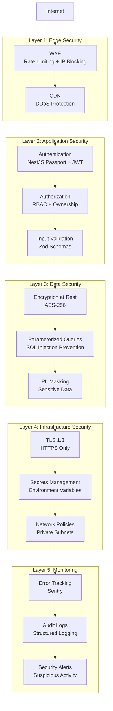

# Security Architecture
## Hakawi - Defense in Depth

---

## Security Layers



---

## Security Principles

1. **Defense in Depth** - Multiple layers of security
2. **Zero Trust** - Never trust, always verify
3. **Least Privilege** - Minimum permissions required
4. **Fail-Closed** - Deny by default on errors
5. **Audit Everything** - Comprehensive logging

---

## Authentication

### NestJS Passport.js
- NestJS Passport is the single authentication layer
- OAuth providers handled via Passport strategies
- Email/password authentication handled with bcrypt hashing
- JWT tokens for API authentication
- No plaintext passwords are stored in the database

### OAuth Providers
- Google
- Apple
- Facebook
- GitHub
- TikTok

### Session Management
- JWT tokens (access + refresh)
- Secure HTTP-only cookies
- Token rotation
- Session revocation

### MFA (Optional)
- TOTP-based
- Recovery codes
- Admin-enforced for sensitive operations

---

## Authorization

### RBAC Model
```
Roles:
- reader: Read published content
- writer: Read + write own content
- rising_star: writer + analytics
- professional: writer + book sales
- publisher: writer + contest management
- admin: Full access

Admin Sub-roles:
- super_admin: All permissions
- content_moderator: Moderate content
- financial_officer: Financial operations
- verification_officer: User verification
```

### Permission Model
- Resource-based permissions (`stories:read`, `stories:write:own`)
- Ownership checks
- Fail-closed design

---

## WAF (Web Application Firewall)

### Threat Detection
- SQL Injection
- XSS (Cross-Site Scripting)
- Path Traversal
- Command Injection
- LDAP Injection
- XML Injection

### Rate Limiting
- Per-IP limits
- Per-user limits
- Fail-closed on storage errors

### IP Blocking
- Temporary blocks (TTL)
- Permanent blocks
- Auto-unblock for temporary blocks

---

## Data Protection

### Encryption
- **At Rest:** AES-256 for sensitive data
- **In Transit:** TLS 1.3
- **Passwords:** bcrypt (if password auth)

### PII Protection
- Email masking in logs
- Phone number encryption
- ID tokenization

### Data Retention
- Logs: 90 days
- Soft deletes: 30 days before purge
- Audit logs: 1 year

---

## Compliance

### GDPR
- Right to erasure
- Data portability
- Consent management
- Privacy by design

### Security Standards
- OWASP Top 10
- CWE Top 25
- PCI DSS (for payments)

---

*This document defines the security architecture for Hakawi.*
