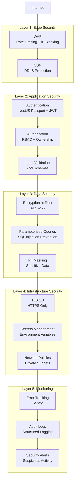

# Security Architecture
## Hakawi - Defense in Depth

---

## Security Layers


```mermaid
graph TB
    subgraph "Layer 1: Edge Security"
        WAF[WAF<br/>Rate Limiting + IP Blocking]
        CDN[CDN<br/>DDoS Protection]
    end

    subgraph "Layer 2: Application Security"
        Auth[Authentication<br/>NestJS Passport + JWT]
        Permissions[Authorization<br/>RBAC + Ownership]
        InputValidation[Input Validation<br/>Zod Schemas]
    end

    subgraph "Layer 3: Data Security"
        Encryption[Encryption at Rest<br/>AES-256]
        ParameterizedQueries[Parameterized Queries<br/>SQL Injection Prevention]
        PIIMasking[PII Masking<br/>Sensitive Data]
    end

    subgraph "Layer 4: Infrastructure Security"
        TLS[TLS 1.3<br/>HTTPS Only]
        Secrets[Secrets Management<br/>Environment Variables]
        Network[Network Policies<br/>Private Subnets]
    end

    subgraph "Layer 5: Monitoring"
        Sentry[Error Tracking<br/>Sentry]
        AuditLogs[Audit Logs<br/>Structured Logging]
        Alerts[Security Alerts<br/>Suspicious Activity]
    end

    Internet --> WAF
    WAF --> CDN
    CDN --> Auth
    Auth --> Permissions
    Permissions --> InputValidation
    InputValidation --> Encryption
    Encryption --> ParameterizedQueries
    ParameterizedQueries --> PIIMasking
    PIIMasking --> TLS
    TLS --> Secrets
    Secrets --> Network
    Network --> Sentry
    Sentry --> AuditLogs
    AuditLogs --> Alerts
```

---

## Security Principles

1. **Defense in Depth** - Multiple layers of security
2. **Zero Trust** - Never trust, always verify
3. **Least Privilege** - Minimum permissions required
4. **Fail-Closed** - Deny by default on errors
5. **Audit Everything** - Comprehensive logging

---

## Authentication

### NestJS Passport.js
- NestJS Passport is the single authentication layer
- OAuth providers handled via Passport strategies
- Email/password authentication handled with bcrypt hashing (12 rounds)
- JWT tokens for API authentication
- No plaintext passwords are stored in the database

### OAuth Providers
- Google
- Apple
- Facebook
- GitHub
- TikTok

### Session Management
- JWT tokens (access + refresh), signed with **separate** secrets
- Secure HTTP-only cookies (`sameSite: 'strict'`, `secure` in production)
- ✅ Token rotation — `refreshTokens()` blacklists the presented refresh token in Valkey
- ✅ Single-token revocation via `POST /api/v1/auth/logout`
- ⛔ **No session store.** There is no session table, no per-user token index, no device/IP capture
  and no concurrent-session cap. See `docs/security-architecture/auth/auth-overview.md`.

### MFA — ⛔ NOT IMPLEMENTED
- ⛔ TOTP is **not** implemented
- ⛔ Recovery codes are **not** implemented
- ⛔ `POST /api/v1/auth/mfa` does **not** exist
- ⛔ Admin-enforcement of MFA is **not** implemented

A `grep -rn "mfa\|totp\|two.factor\|2fa"` across `backend/src`, `frontend/src` and `packages/`
returns zero matches. An admin account is protected by authorization only. The requirement is
retained in `docs/security-architecture/auth/auth-overview.md`.

---

## Authorization

### RBAC Model
```
Account types (6) — packages/shared-types/src/user.ts:4
- reader: Read published content
- writer: Read + write own content
- rising_star: reader + writer
- professional: reader + writer + book sales
- publisher: reader + writer + contest management
- admin: all six

Admin sub-roles (4) — packages/shared-types/src/user.ts:16
- super_admin: all permissions
- content_moderator: moderate content
- financial_officer: financial operations
- verification_officer: user verification
```

Legacy DB values are normalized: `author` → `writer`, `moderator` → `content_moderator`,
`finance` → `financial_officer`. Unrecognised values fall back to `reader`.

### Permission Model — ✅ implemented
- `backend/src/common/permissions/permissions.ts`: **51** permissions
- Format `{resource}:{action}` or `{resource}:{action}:{scope}` (scope `own|all|platform`)
- `PERMISSIONS_BY_ACCOUNT_TYPE` and `PERMISSIONS_BY_ROLE` resolve the caller's grants
- `@Secured()` composes `JwtAuthGuard` + `RolesGuard` + `PermissionsGuard`
- Fail-closed

⚠️ Two documented pieces are **not** wired:
- ⛔ `OwnershipGuard` is a factory (`createOwnershipGuard`-style: `reflector`, `resolver`, `options`)
  used by **no** module; ownership is enforced inline in services.
- ⛔ No permission-decision audit trail.

See `docs/security-architecture/permissions/permissions-overview.md`.

---

## WAF (Web Application Firewall)

### Threat Detection — ✅ implemented
35 typed rules in 8 layers (`backend/src/common/waf/rules.ts`), of which 34 evaluate by default
(`header-forbidden-forwarding-headers` is opt-in behind `WAF_BLOCK_FORWARDING_HEADERS=true`), covering:
- SQL Injection (8 rules)
- NoSQL injection and LDAP injection (3 rules)
- OS command injection (5 rules)
- XSS (5 rules)
- Path traversal (4 rules)
- SSRF (3 rules)
- Bot / scanner user agents (2 rules)
- Header injection (2 rules)
- Method and body-size controls (2 rules)

⛔ XML injection (XXE) is **not** covered by any rule.
⛔ The old rule that blocked `'`, `#` and `--` anywhere in a body — which 403'd ordinary Arabic and
English prose — has been **removed**.

### Rate Limiting — ✅ implemented, Valkey-backed
Four tiers in `backend/src/config/throttle.config.ts`:
`default` 100/min per user · `auth` 10/min per IP · `upload` 5/min per user · `search` 50/min per
user. Storage is `ValkeyThrottlerStorage`, so limits are shared across instances. Fail mode is
**fail-open**, not fail-closed: if Valkey is unreachable the request is allowed.

### IP Blocking — ✅ implemented
- Temporary blocks (Valkey TTL, default 1h)
- Permanent blocks (no TTL)
- Auto-unblock for temporary blocks via TTL
- ⛔ **No admin HTTP endpoints.** `GET /admin/waf/blocked-ips` and friends do not exist; the
  `IpBlocklistService` methods exist but nothing exposes them over HTTP.

See `docs/security-architecture/waf/waf-overview.md`.

---

## Data Protection

### Encryption
- **At Rest:** ✅ AES-256-GCM for sensitive columns (email verification token, password reset
  token) — `backend/src/common/utils/encryption.util.ts`
- **In Transit:** ⚠️ **deployment responsibility.** The app has no HTTPS redirect, no
  `trust proxy`, and no TLS configuration. `Secure` cookies and HSTS (production only) are all it
  does.
- **Passwords:** ✅ bcrypt, 12 rounds (`backend/src/common/utils/password.util.ts:7`)

### PII Protection
- ⛔ Email masking in logs — **not implemented**; the winston logger writes raw message context
- ⛔ Phone number encryption — **not implemented**; the platform stores no phone numbers
- ⛔ ID tokenization — **not implemented**; UUIDs are used directly

### Data Retention — ⛔ NOT IMPLEMENTED
No retention job, no purge, and no lifecycle policy exists in the codebase.
- ⛔ Logs: 90 days — no log-rotation or retention configuration
- ⛔ Soft deletes: 30 days before purge — `deleted_at` is set on 7 of 33 tables and is **never
  purged**; nothing sweeps it
- ⛔ Audit logs: 1 year — no audit log store

---

## Compliance
- ⛔ GDPR right to erasure: not implemented as a workflow
- ⛔ Data portability: not implemented
- ⛔ Consent management: not implemented
- ⚠️ Privacy by design: partially — `deleted_at` exists on 7 tables, but no erasure path
- ✅ OWASP Top 10 awareness: reflected in the WAF rule set and the authz guards
- ✅ CWE awareness: reflected in the WAF rule set
- ⚠️ PCI DSS: payments are tokenised through Paymob and no card data touches this codebase; no
  PCI DSS documentation or SAQ exists in the repository

---

## Changelog — reconciliation (2026-09-30)

| Claim | Reality | Evidence |
|---|---|---|
| "MFA (Optional): TOTP, recovery codes, admin-enforced" | ⛔ Not implemented at all | zero `mfa`/`totp` matches in `backend/`, `frontend/`, `packages/` |
| "Session management: token rotation, session revocation" | Rotation ✅ and single-token revocation ✅ are real; ⛔ there is no session store, session metadata, concurrent-session cap, or bulk revocation | `backend/src/modules/auth/auth.service.ts:549-641` |
| "Permission model: `stories:read`, `stories:write:own`" | 51 real permissions; `stories:write:own` does not exist (`stories:edit:own` does) | `backend/src/common/permissions/permissions.ts` |
| "Ownership checks" as a guard | ⛔ `OwnershipGuard` is a factory used by no module | `backend/src/common/guards/ownership.guard.ts` |
| "Fail-closed on storage errors" for rate limiting | **Fail-open** by design | `backend/src/common/throttler/valkey-throttler.storage.ts` |
| "XML Injection" listed as detected | ⛔ No XML rule exists | absent from `rules.ts` |
| Data protection: PII masking, retention 90d/30d/1y | ⛔ None implemented | — |
| Compliance: GDPR/PII claims | ⛔ No erasure, portability, or consent workflow | — |
| In-transit encryption as an application property | ⚠️ Deployment responsibility; no HTTPS redirect or `trust proxy` | absent from `backend/src/main.ts` |

**Newly documented (was missing entirely):** the authorization hole that is now closed —
`@RequireAdminRole` was dead metadata with no `RolesGuard` applied, so any authenticated user could
read moderation statistics. `@Secured()` now wires `RolesGuard` and `PermissionsGuard`.

---

*This document defines the security architecture for Hakawi.*
