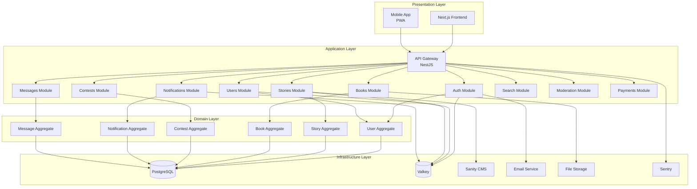
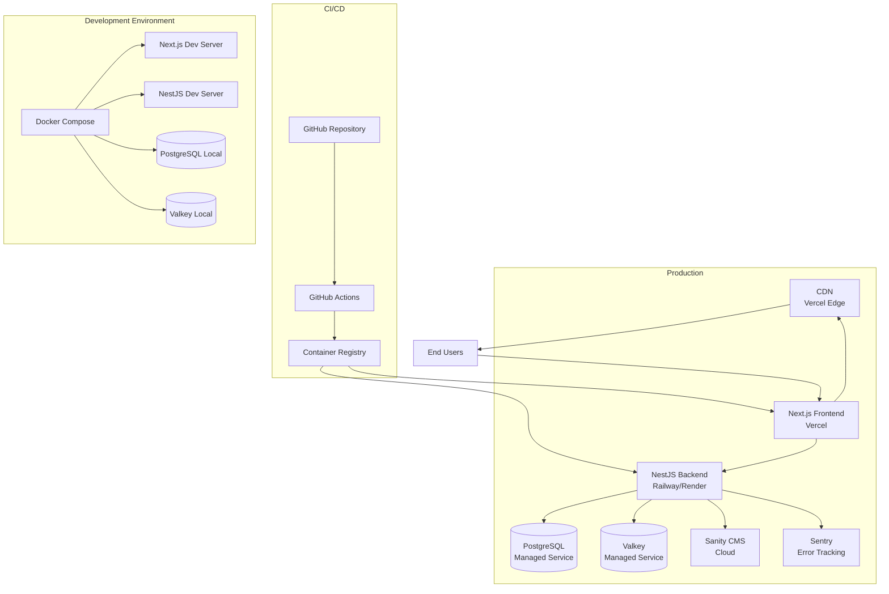
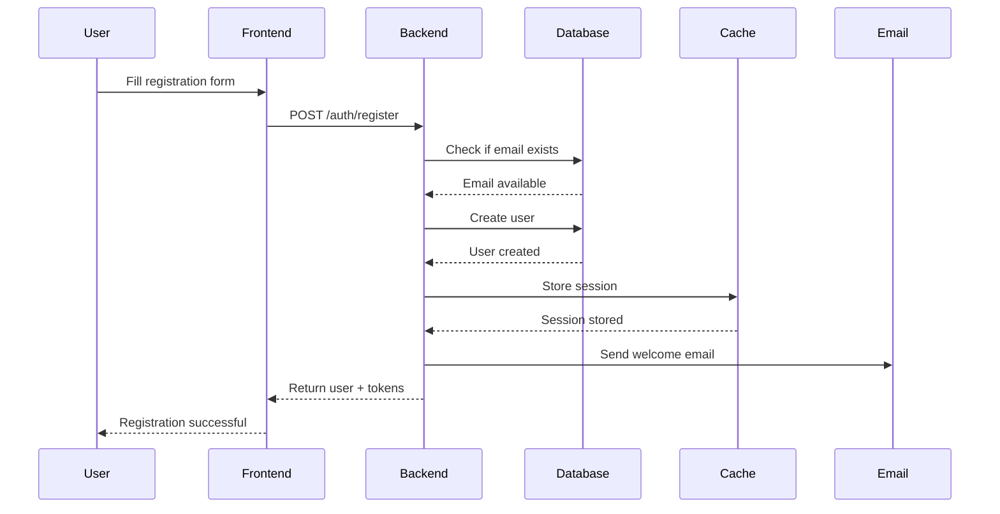
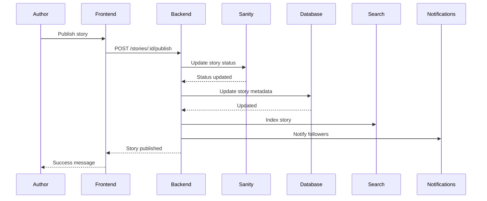
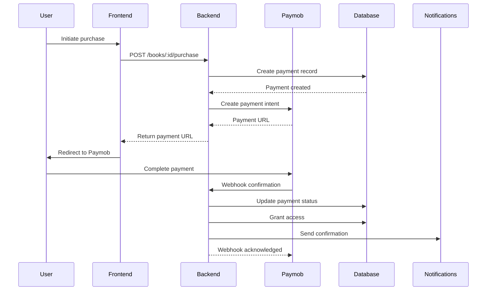
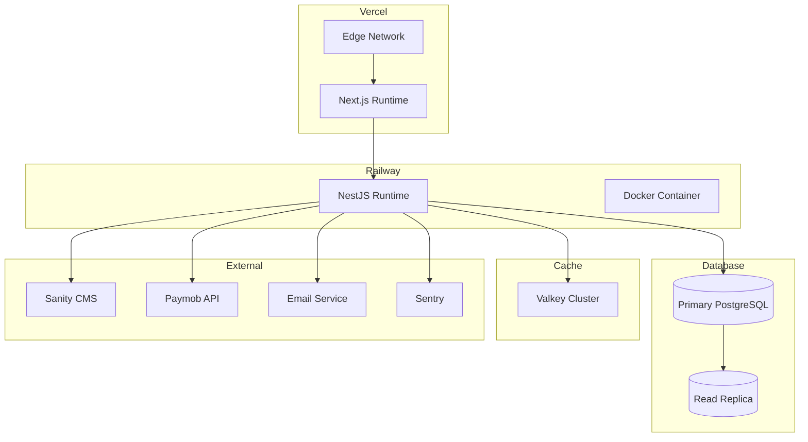
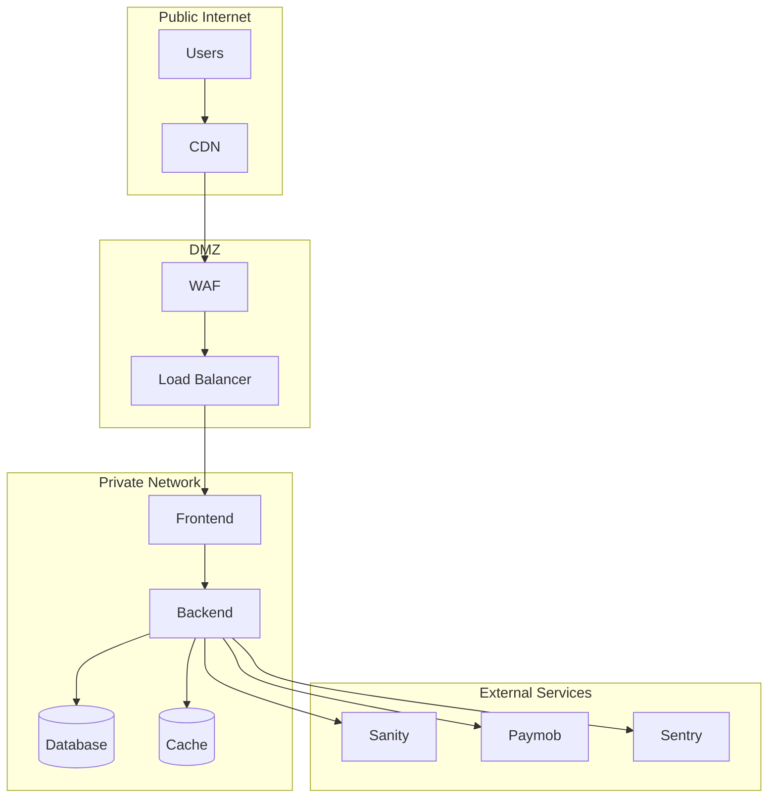
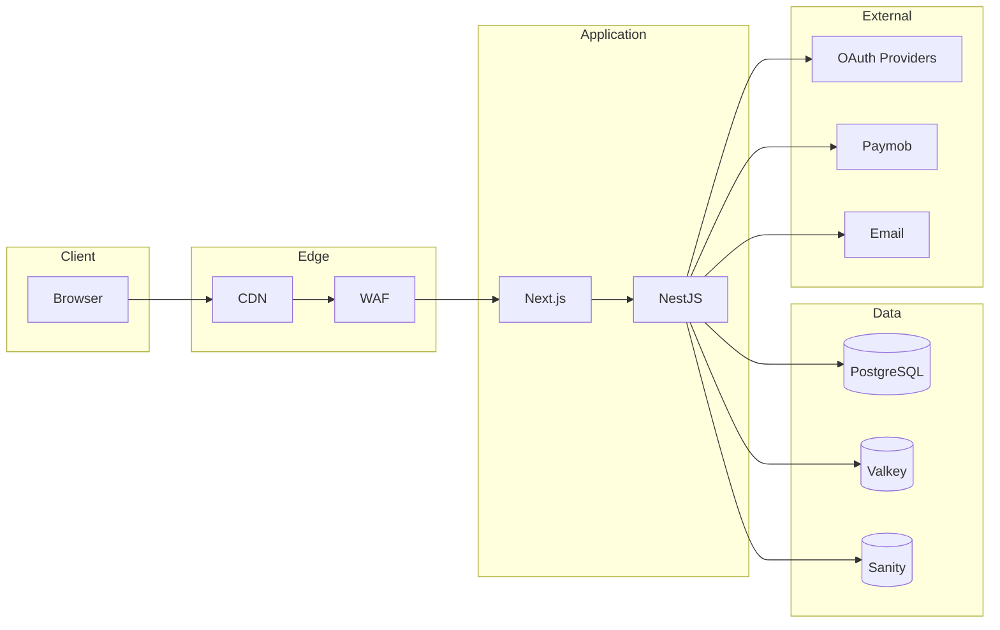

# System Architecture Overview
## Hakawi - High-Level Architecture

---

## Architecture Vision

Hakawi is built as a **modular monolith** with an **event-driven** internal communication pattern. This architecture provides the simplicity of a single deployable unit while maintaining the flexibility to extract services into microservices in the future.

---

## Architectural Principles

1. **Modular Monolith** - Single deployable unit with clear module boundaries
2. **Event-Driven** - Internal communication via events
3. **Domain-Driven Design** - Modules organized by business domain
4. **Repository Pattern** - Data access abstraction
5. **Single Source of Truth** - One authoritative source per entity

---

## Architecture Patterns

- **Modular Monolith** - Single deployable unit with clear module boundaries
- **Event-Driven Internal Communication** - Loose coupling via event bus
- **Repository Pattern** - Abstraction over data access
- **Service Layer** - Business logic encapsulation
- **Guard/Interceptor/Pipe Pipeline** - NestJS middleware chain
- **SSOT per Bounded Context** - Single source of truth within each module

---

## High-Level Architecture

---

## Layer Responsibilities

### Presentation Layer
- **Responsibility:** User interface and user experience
- **Technology:** Next.js, Shadcn UI, Tailwind CSS
- **Concerns:** Routing, state management, UI components

### Application Layer
- **Responsibility:** Application-specific business logic, orchestration
- **Technology:** NestJS modules, controllers, services
- **Concerns:** Use cases, workflows, transactions

### Domain Layer
- **Responsibility:** Core business logic, domain rules
- **Technology:** TypeScript classes, interfaces
- **Concerns:** Entities, value objects, aggregates, domain events

### Infrastructure Layer
- **Responsibility:** Technical implementation details
- **Technology:** PostgreSQL, Valkey, Sanity, Email APIs
- **Concerns:** Persistence, caching, external integrations

---

## Key Architectural Decisions

### 1. Modular Monolith vs Microservices
**Decision:** Modular monolith

**Rationale:**
- Single deployment unit
- Simpler operations
- Easier debugging
- Can extract to microservices later

### 2. Event-Driven Internal Communication
**Decision:** Event bus for module communication

**Rationale:**
- Loose coupling between modules
- Extensibility without modification
- Audit trail via event log
- Easy to add new listeners

### 3. Service Layer Pattern
**Decision:** Service layer for all business logic

**Rationale:**
- Encapsulates business rules
- Reusable across controllers
- Testable in isolation
- Transaction management

### 4. Repository Pattern
**Decision:** Repository pattern for all data access

**Rationale:**
- Abstraction over data source
- Testability
- Flexibility to change data source

### 5. Single Source of Truth
**Decision:** One authoritative source per entity

**Rationale:**
- No data duplication
- Simplified consistency
- Clear ownership

---

## Technology Stack

### Frontend
- **Framework:** Next.js 16 (App Router)
- **UI Library:** Shadcn UI
- **Styling:** Tailwind CSS
- **State Management:** TanStack Query
- **Language:** TypeScript

### Backend
- **Framework:** NestJS
- **Language:** TypeScript
- **API Style:** REST
- **Validation:** class-validator
- **Authentication:** NestJS Passport strategies
- **Documentation:** Swagger/OpenAPI

### Data
- **Primary Database:** PostgreSQL 15+
- **ORM:** Drizzle ORM
- **Cache:** Valkey (Redis-compatible)
- **Content:** Sanity CMS
- **IDs:** UUID v4

### Infrastructure
- **Containerization:** Docker + Docker Compose
- **Deployment:** Vercel (frontend), Railway/Render (backend)
- **Monitoring:** Sentry
- **Logging:** Winston

---

## Deployment Architecture

---

## Sequence Diagrams

### User Registration Flow

### Story Publishing Flow

### Payment Flow

---

## Infrastructure Diagram

---

## Network Architecture

---

## Data Flow Diagram

---

## Scalability Strategy

### Current (Monolith)
- Single NestJS instance
- PostgreSQL with connection pooling
- Valkey for caching

### Future (Scale)
- Horizontal scaling of NestJS instances
- Read replicas for PostgreSQL
- Valkey cluster for cache
- Extract modules to microservices if needed

---

## Observability

- **Logging:** Winston with structured JSON output
- **Error Tracking:** Sentry
- **Metrics:** Custom metrics via Prometheus (future)
- **Tracing:** Correlation IDs across services

---

*This document defines the high-level system architecture for Hakawi.*
