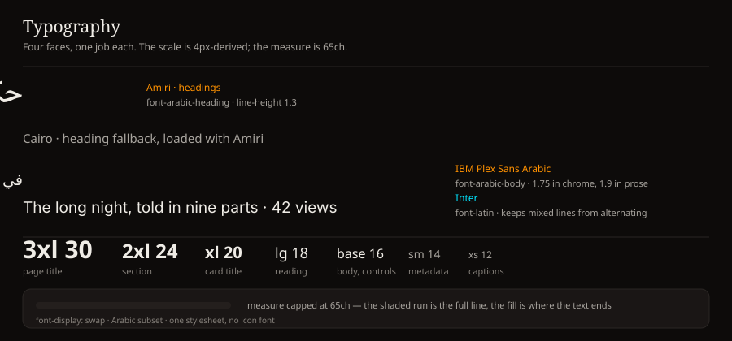
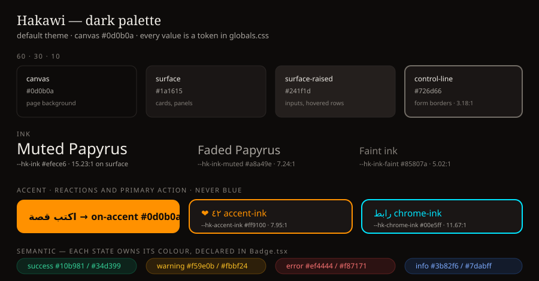
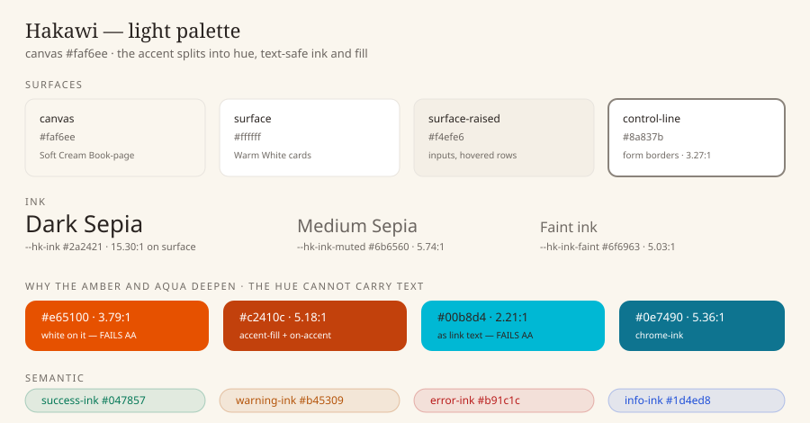
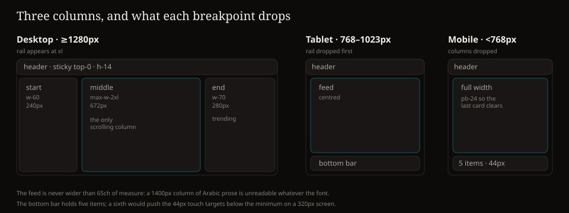
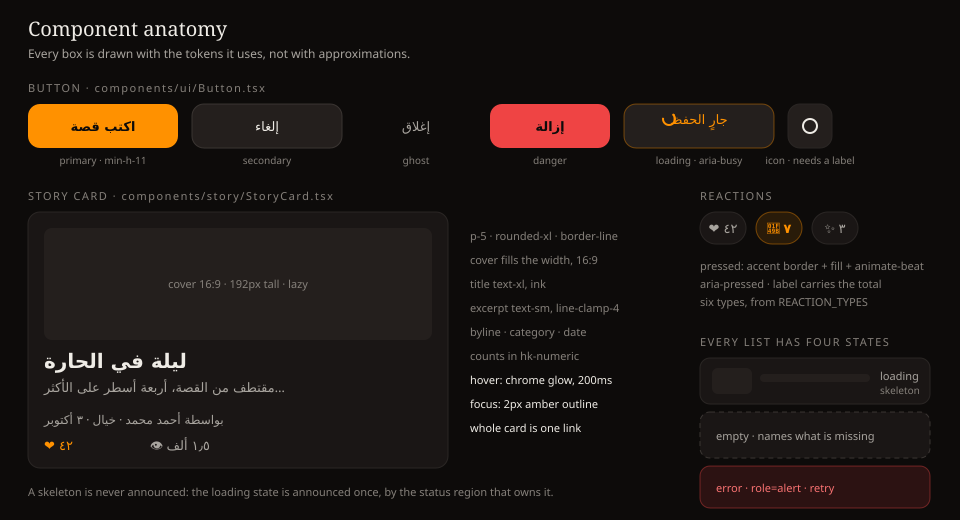
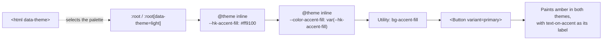

# UI/UX Design System
## Hakawi — Visual Design and User Experience

> **This document and the product are held together by a test.**
> `frontend/src/app/design-system.test.ts` parses this file and
> `frontend/src/app/globals.css` and fails the build when they disagree: a colour
> documented here that no token defines, a token in the stylesheet this document
> never mentions, or a contrast ratio printed here that the tokens do not
> actually produce. Every number in §4 was measured, not asserted.

**Contents**

| § | Section | What it pins down |
|---|---------|--------------------|
| 1 | [Design philosophy](#1-design-philosophy) | The five principles and how to weigh them |
| 2 | [Typography](#2-typography) | Four faces, the scale, the measure |
| 3 | [Spacing, radius, elevation](#3-spacing-radius-elevation) | The 4px base and the two shadows |
| 4 | [Colour](#4-colour) | Both palettes, the split tokens, the measured contrast |
| 5 | [Layout](#5-layout) | Three columns, three breakpoints, what each one drops |
| 6 | [Components](#6-components) | Every component, its anatomy, its states, its file |
| 7 | [UX patterns](#7-ux-patterns) | Infinite scroll, optimism, skeletons, empty states |
| 8 | [Accessibility](#8-accessibility) | The rules, and where they are checked |
| 9 | [Performance](#9-performance) | The budgets and how they are met |
| 10 | [Design tokens](#10-design-tokens) | The CSS-first mapping every component consumes |
| 11 | [Theming](#11-theming-dark-default) | The bootstrap, the toggle, the persistence |
| 12 | [RTL and language](#12-rtl-and-language) | Mirroring, logical properties, i18n scope |
| 13 | [Conformance matrix](#13-conformance-matrix) | Every rule → the file that implements it |
| 14 | [Deviations and known gaps](#14-deviations-and-known-gaps) | What is deliberately not done |

---

## 1. Design philosophy

### 1.1 Core identity

Hakawi is an Arabic storytelling platform inspired by Egyptian storytelling
sessions and folk narrative. The design balances **modern minimalism** with
**warmth that encourages writing**: the reading surface is quiet and
long-form-friendly, and the writing surface is the warmest thing on the screen.

### 1.2 Principles

1. **Readability first.** Long-form reading is the primary use case. Every
   decision — measure, line height, contrast, motion — is subordinate to it.
2. **Warm minimalism.** Clean layouts without coldness. Warmth comes from colour
   temperature (the canvas is near-black with a warm bias, not neutral black) and
   typography, not decoration.
3. **Optimistic responsiveness.** The interface answers the reader on the same
   frame as the tap; the server decides afterwards, and a failure explains itself.
4. **Progressive disclosure.** Show what is needed; expand on demand. The feed is
   a list until it is not.
5. **Performance as a feature.** Skeletons, lazy images and route splitting are
   part of the experience, not polish applied at the end.

### 1.3 How to weigh a conflict

In order: **accessibility → reading comfort → task completion → consistency →
delight**. A delightful animation that moves text under the reader's eye loses to
a still one. When a rule in this document and a preference conflict, the rule
wins and the deviation is written down in §14.

---

## 2. Typography

### 2.1 Faces

| Role | Family | Variable | Why |
|------|--------|----------|-----|
| Arabic headings | **Amiri** | `--font-amiri` | A naskh with real calligraphic weight; it carries the storytelling register without being decorative |
| Arabic headings, fallback | **Cairo** | `--font-cairo` | Modern grotesque; the fallback when Amiri fails to load |
| Arabic body | **IBM Plex Sans Arabic** | `--font-ibm-plex-arabic` | Built for Arabic at UI sizes; even colour, tall ascenders, low eye strain over a long session |
| Latin, all roles | **Inter** | `--font-inter` | Keeps mixed-script lines from alternating between two serifs |

All four load through `next/font/google` with `display: "swap"` and are mounted
once, from `frontend/src/app/fonts.ts`. Utilities: `font-arabic-heading`,
`font-arabic-body`, `font-latin`.



### 2.2 Scale

```
text-xs   0.75rem / 12px     labels, captions, metadata
text-sm   0.875rem / 14px    secondary text, bylines, card excerpts
text-base 1rem / 16px        body text, form controls
text-lg   1.125rem / 18px    lead paragraphs, long-form reading
text-xl   1.25rem / 20px     card titles
text-2xl  1.5rem / 24px      section headings
text-3xl  1.875rem / 30px    page titles
text-4xl  2.25rem / 36px     hero text
```

Headings use `--hk-line-height: 1.3`; body uses **1.75** in chrome and **1.9**
inside `.hk-prose`. Arabic needs the extra leading more than Latin does: the
script has taller ascenders and descenders and no reliable word-shape
disambiguation at small sizes.

### 2.3 Measure and rhythm

- **Max measure:** `65ch` (`--hk-measure`), applied by `.hk-prose` and by any
  block of long-form prose. Two thirds of the feed column, not the whole of it.
- **Paragraph spacing:** `1.5em` between blocks in `.hk-prose`, never a margin on
  the last child.
- **Numerals:** anything countable, monetary or a percentage is wrapped in
  `.hk-numeric` (`direction: ltr; font-variant-numeric: tabular-nums;
  unicode-bidi: isolate`). Without the isolate, a minus sign or a currency symbol
  lands on the wrong side of an RTL number.

### 2.4 The reading surface

Story bodies arrive as HTML from the API and are rendered with
`dangerouslySetInnerHTML`, so a component `className` cannot style them. Every
descendant therefore has a rule inside `.hk-prose` (`globals.css` §4):
`p/h1-h3/a/blockquote/ul/ol/li/img/code/hr`, with a 3px accent border on
`blockquote` and `underline-offset: 3px` on links. `line-clamp-4` bounds the
excerpt in a card; `line-clamp-2` bounds it in a compact card.

---

## 3. Spacing, radius, elevation

### 3.1 Spacing — base unit 4px

`space-1` 4px · `space-2` 8px · `space-3` 12px · `space-4` 16px · `space-5` 20px
· `space-6` 24px · `space-8` 32px · `space-10` 40px · `space-12` 48px ·
`space-16` 64px. These are Tailwind's defaults and are declared here because the
spacing *of components* is a decision:

| Component | Padding | Gap |
|-----------|---------|-----|
| `Button` | `px-4 py-2` (`sm`: `px-3`, `lg`: `px-6`) | `gap-2` to its icon |
| `Card` | `p-6` | `gap-4` between parts |
| `StoryCard` | `p-5` | `gap-3` between the cover, the title and the meta row |
| Form input | `px-3 py-2` | `mt-1.5` to its message |
| Feed items | — | `space-y-6` |
| Lists (messages, payments) | `p-5` per row | `space-y-2` inside a row |

### 3.2 Radius

`rounded-lg` 8px on controls · `rounded-xl` 12px on cards, buttons and toasts ·
`rounded-2xl` 16px on the large brand mark · `rounded-full` on avatars, pills and
the progress bar. Nothing is sharper than 8px: the product is made of paper and
ink, and a hard 2px corner reads as a developer tool.

### 3.3 Elevation

Two levels and no more. A third would mean the layout is stacking surfaces to
paper over an ambiguity.

| Token | Dark | Light | Use |
|-------|------|-------|-----|
| `--shadow-card` | `0 1px 2px rgb(0 0 0/.4), 0 8px 24px rgb(0 0 0/.24)` | `0 1px 2px rgb(42 36 33/.06), 0 8px 24px rgb(42 36 33/.08)` | Cards at rest, toasts |
| `--shadow-pop` | `0 12px 40px rgb(0 0 0/.45)` | `0 12px 40px rgb(42 36 33/.12)` | Toasts and anything that floats |

Interaction glows are not elevation: `--hk-glow-chrome` (aqua, 15px blur) marks a
card that is a link, `--hk-glow-accent` (amber, 15px blur) marks a reaction.

---

## 4. Colour

### 4.1 The 60-30-10 rule

Sixty per cent canvas, thirty per cent surfaces, ten per cent accent. The accent
is small on purpose: it is spent on the things a reader acts on (reactions, the
primary action, the active nav item) and on nothing else. An accent used for
decoration stops being a signal.

### 4.2 Dark theme (default)

| Role | Token | Hex | On | Used by |
|------|-------|-----|----|---------|
| Dominant (60%) | `--hk-canvas` | `#0d0b0a` | — | page background |
| Structural (30%) | `--hk-surface` | `#1a1615` | — | cards, panels, sidebars |
| Raised | `--hk-surface-raised` | `#241f1d` | — | inputs, hovered rows, skeletons |
| Divider | `--hk-line` | `#2a2624` | — | card edges, table rules |
| Divider, emphasised | `--hk-line-strong` | `#3a3532` | — | hovered card edges |
| Control boundary | `--hk-control-line` | `#726d66` | — | the border of every form control |
| Text primary | `--hk-ink` | `#efece6` | — | headings, body |
| Text secondary | `--hk-ink-muted` | `#a8a49e` | — | metadata, excerpts |
| Text tertiary | `--hk-ink-faint` | `#85807a` | — | placeholders, ordinals |
| Accent hue | `--hk-accent` | `#ff9100` | — | reaction glyphs, glows, marks |
| Accent text | `--hk-accent-ink` | `#ff9100` | — | links, active nav, numbers in accent |
| Accent fill | `--hk-accent-fill` | `#ff9100` | — | primary buttons, progress |
| On accent fill | `--hk-on-accent` | `#0d0b0a` | — | the label on an accent fill |
| Accent hover | `--hk-accent-hover` | `#ffa733` | — | primary hover |
| Chrome hue | `--hk-chrome` | `#00e5ff` | — | nav marks, category chips |
| Chrome text | `--hk-chrome-ink` | `#00e5ff` | — | links, secondary buttons |
| Chrome hover | `--hk-chrome-hover` | `#66efff` | — | link hover |
| Success | `--hk-success` / `--hk-success-ink` | `#10b981` / `#34d399` | — | owned, active, completed |
| Warning | `--hk-warning` / `--hk-warning-ink` | `#f59e0b` / `#fbbf24` | — | pending, reading in progress |
| Error | `--hk-error` / `--hk-error-fill` | `#ef4444` / `#ef4444` | — | overdue, expired, destructive |
| On error fill | `--hk-on-error` | `#0d0b0a` | — | the label on a destructive button |
| Error text | `--hk-error-ink` | `#f87171` | — | validation text, banners |
| Info | `--hk-info` / `--hk-info-ink` | `#3b82f6` / `#7dabff` | — | contests, neutral notices |



### 4.3 Light theme

| Role | Token | Hex | Notes |
|------|-------|-----|-------|
| Dominant (60%) | `--hk-canvas` | `#faf6ee` | Soft Cream Book-page |
| Structural (30%) | `--hk-surface` | `#ffffff` | Warm White cards |
| Raised | `--hk-surface-raised` | `#f4efe6` | inputs, hovered rows |
| Divider | `--hk-line` | `#e8e4de` | Light Sepia |
| Divider, emphasised | `--hk-line-strong` | `#d6d0c7` | hovered card edges |
| Control boundary | `--hk-control-line` | `#8a837b` | see §4.5 |
| Text primary | `--hk-ink` | `#2a2421` | Dark Sepia |
| Text secondary | `--hk-ink-muted` | `#6b6560` | Medium Sepia |
| Text tertiary | `--hk-ink-faint` | `#6f6963` | placeholders, ordinals |
| Accent hue | `--hk-accent` | `#e65100` | Burnt Amber: marks, glows, ≥24px text |
| Accent text | `--hk-accent-ink` | `#b34700` | a deeper amber, because this one carries text |
| Accent fill | `--hk-accent-fill` | `#c2410c` | the button fill that white can sit on |
| On accent fill | `--hk-on-accent` | `#ffffff` | |
| Accent hover | `--hk-accent-hover` | `#a8390a` | |
| Chrome hue | `--hk-chrome` | `#00b8d4` | Deep Aqua marks |
| Chrome text | `--hk-chrome-ink` | `#0e7490` | links, because aqua cannot carry text here |
| Chrome hover | `--hk-chrome-hover` | `#0b5e74` | |
| Success | `--hk-success` / `--hk-success-ink` | `#10b981` / `#047857` | |
| Warning | `--hk-warning` / `--hk-warning-ink` | `#f59e0b` / `#b45309` | |
| Error | `--hk-error` / `--hk-error-fill` | `#ef4444` / `#dc2626` | |
| On error fill | `--hk-on-error` | `#ffffff` | |
| Error text | `--hk-error-ink` | `#b91c1c` | |
| Info | `--hk-info` / `--hk-info-ink` | `#3b82f6` / `#1d4ed8` | |



### 4.4 Why each accent is three tokens

One hue cannot be both the brand colour and a legible background. Measured on
`--hk-surface`:

| Colour | Ratio on white | Verdict |
|--------|----------------|---------|
| `#e65100` Burnt Amber as a fill with white text | 3.79:1 | **fails AA** for body-size text |
| `#c2410c` as a fill with white text | 5.18:1 | passes |
| `#00b8d4` Deep Aqua as link text | 2.21:1 | **fails** AA badly |
| `#0e7490` as link text | 5.36:1 | passes |
| `#ef4444` Coral with white text | 3.76:1 | **fails** |
| `#dc2626` with white text | 4.83:1 | passes |

So every accent is split in three, and the *role* picks the token:

- `--hk-accent` — the hue. Marks, glows, reaction glyphs, and text at 24px or
  larger, where 3:1 is the AA threshold.
- `--hk-accent-ink` — the text-safe variant, used for links, active navigation
  and accent-coloured numbers.
- `--hk-accent-fill` + `--hk-on-accent` — the button fill and the *only* colour
  that may sit on it. The pair differs per theme: obsidian on amber in dark,
  white on a deeper amber in light.

The same split applies to `--hk-error-fill` / `--hk-on-error`. This is the single
most consequential correction this design system makes to the palette it started
from, and it is why the button's label is a token rather than a hard-coded white.

### 4.5 Borders: the one place contrast is load-bearing

`--hk-line` is decorative: it separates two surfaces of almost the same
luminance (1.31:1 against the canvas in dark, 1.17:1 in light) and WCAG 1.4.11
does not ask for more, because a card's edge is not the only way to identify it.

A form control's edge **is**. An input drawn with `--hk-line` is 1.20:1 against
its own background — an input a low-vision reader may not see at all. So
controls use `--hk-control-line`, which clears the 3:1 that 1.4.11 requires.

### 4.6 Measured contrast

Every ratio below is recomputed from the tokens by
`frontend/src/app/design-system.test.ts` and compared to the printed value.

**Dark**

| Pair | Colours | Measured | Required |
|------|---------|----------|----------|
| body text on the canvas | `--hk-ink` on `--hk-canvas` (dark) | 16.66:1 | 4.5:1 |
| body text on a card | `--hk-ink` on `--hk-surface` (dark) | 15.23:1 | 4.5:1 |
| body text on a raised row | `--hk-ink` on `--hk-surface-raised` (dark) | 13.82:1 | 4.5:1 |
| secondary text on the canvas | `--hk-ink-muted` on `--hk-canvas` (dark) | 7.92:1 | 4.5:1 |
| secondary text on a card | `--hk-ink-muted` on `--hk-surface` (dark) | 7.24:1 | 4.5:1 |
| tertiary text on the canvas | `--hk-ink-faint` on `--hk-canvas` (dark) | 5.02:1 | 4.5:1 |
| accent text on the canvas | `--hk-accent-ink` on `--hk-canvas` (dark) | 8.70:1 | 4.5:1 |
| accent text on a card | `--hk-accent-ink` on `--hk-surface` (dark) | 7.95:1 | 4.5:1 |
| accent text on a raised row | `--hk-accent-ink` on `--hk-surface-raised` (dark) | 7.22:1 | 4.5:1 |
| navigation text on the canvas | `--hk-chrome-ink` on `--hk-canvas` (dark) | 12.77:1 | 4.5:1 |
| navigation text on a card | `--hk-chrome-ink` on `--hk-surface` (dark) | 11.67:1 | 4.5:1 |
| label on the primary button | `--hk-on-accent` on `--hk-accent-fill` (dark) | 8.70:1 | 4.5:1 |
| label on the danger button | `--hk-on-error` on `--hk-error-fill` (dark) | 5.22:1 | 4.5:1 |
| success text | `--hk-success-ink` on `--hk-surface` (dark) | 9.34:1 | 4.5:1 |
| warning text | `--hk-warning-ink` on `--hk-surface` (dark) | 10.76:1 | 4.5:1 |
| error text | `--hk-error-ink` on `--hk-surface` (dark) | 6.49:1 | 4.5:1 |
| info text | `--hk-info-ink` on `--hk-surface` (dark) | 7.82:1 | 4.5:1 |
| form control boundary | `--hk-control-line` on `--hk-surface-raised` (dark) | 3.18:1 | 3:1 |

**Light**

| Pair | Colours | Measured | Required |
|------|---------|----------|----------|
| body text on the canvas | `--hk-ink` on `--hk-canvas` (light) | 14.19:1 | 4.5:1 |
| body text on a card | `--hk-ink` on `--hk-surface` (light) | 15.30:1 | 4.5:1 |
| body text on a raised row | `--hk-ink` on `--hk-surface-raised` (light) | 13.36:1 | 4.5:1 |
| secondary text on the canvas | `--hk-ink-muted` on `--hk-canvas` (light) | 5.33:1 | 4.5:1 |
| secondary text on a card | `--hk-ink-muted` on `--hk-surface` (light) | 5.74:1 | 4.5:1 |
| tertiary text on the canvas | `--hk-ink-faint` on `--hk-canvas` (light) | 5.03:1 | 4.5:1 |
| accent text on the canvas | `--hk-accent-ink` on `--hk-canvas` (light) | 5.10:1 | 4.5:1 |
| accent text on a card | `--hk-accent-ink` on `--hk-surface` (light) | 5.50:1 | 4.5:1 |
| accent text on a raised row | `--hk-accent-ink` on `--hk-surface-raised` (light) | 4.80:1 | 4.5:1 |
| navigation text on the canvas | `--hk-chrome-ink` on `--hk-canvas` (light) | 4.97:1 | 4.5:1 |
| navigation text on a card | `--hk-chrome-ink` on `--hk-surface` (light) | 5.36:1 | 4.5:1 |
| label on the primary button | `--hk-on-accent` on `--hk-accent-fill` (light) | 5.18:1 | 4.5:1 |
| label on the danger button | `--hk-on-error` on `--hk-error-fill` (light) | 4.83:1 | 4.5:1 |
| success text | `--hk-success-ink` on `--hk-surface` (light) | 5.48:1 | 4.5:1 |
| warning text | `--hk-warning-ink` on `--hk-surface` (light) | 5.02:1 | 4.5:1 |
| error text | `--hk-error-ink` on `--hk-surface` (light) | 6.47:1 | 4.5:1 |
| info text | `--hk-info-ink` on `--hk-surface` (light) | 6.70:1 | 4.5:1 |
| form control boundary | `--hk-control-line` on `--hk-surface-raised` (light) | 3.27:1 | 3:1 |

### 4.7 Rules

- **Never** pure black or pure white as a canvas in dark mode, and never a
  stock Tailwind colour anywhere.
- **Amber is for social reactions** — `like`, `love`, `wow`, `sad`, `angry`,
  `haunted` — and for nothing that is not a reaction. Never blue. The set itself
  comes from `REACTION_TYPES` in `@hakawi/shared-types`, not from a local array.
- **Aqua is for navigation and chrome** — links, secondary actions, active
  navigation. Never for a content highlight.
- **Semantic states own their colour.** `owned`, `active`, `completed` are
  success; `reading`, `pending` are warning; `overdue`, `expired`, `failed` are
  error. The mapping is declared once, in `components/ui/Badge.tsx`, and read
  through `toneFor`.

---

## 5. Layout

### 5.1 Breakpoints

| Name | Width | Used for |
|------|-------|----------|
| `sm` | 640px | large phones — wider gutters |
| `md` | 768px | tablets |
| `lg` | 1024px | **the nav column appears**, the bottom bar disappears |
| `xl` | 1280px | **the trending rail appears** |
| `2xl` | 1536px | large desktops |

### 5.2 Desktop (≥1280px)

```
┌────────────────────────────────────────────────────────────────────────┐
│ Header — sticky top-0, h-14, brand · search · theme · language · profile│
├──────────────┬───────────────────────────────┬─────────────────────────┤
│              │                               │                         │
│  Start       │      Middle column            │   End                   │
│  (RTL right) │      max-w-2xl (672px)        │   (RTL left)            │
│  w-60 240px  │      the feed                 │   w-70 280px            │
│  nav + CTA   │      max-w-2xl is not a       │   trending rail + CTA   │
│  + sign out   │      negotiable: §2.3 asks   │                         │
│              │      for a 65ch measure        │                         │
└──────────────┴───────────────────────────────┴─────────────────────────┘
```

At 1024–1279px the nav column and the feed still fit; 240 + 672 + gutters is
already 950px of fixed width, so the rail is the first thing to go. The feed and
the navigation are the two things a reader cannot do without; discovery is the
one that can wait.

### 5.3 Tablet (768–1023px)

```
┌──────────────────────────────────────────┐
│ Header (sticky, h-14)                     │
├──────────────────────────────────────────┤
│                                          │
│      Middle column, max-w-2xl, centred    │
│                                          │
├──────────────────────────────────────────┤
│ Bottom navigation (5 items)              │
└──────────────────────────────────────────┘
```

### 5.4 Mobile (<768px)

```
┌────────────────────────┐
│ Header (h-14)          │
├────────────────────────┤
│  Feed, full width      │
│                        │
│  pb-24 — the last card │
│  clears the bar        │
├────────────────────────┤
│ Bottom navigation      │
└────────────────────────┘
```



### 5.5 The unauthenticated frame

`/login`, `/register`, `/forgot-password` and `/reset-password` share one layout,
`components/auth/AuthShell.tsx`:

```
┌──────────────────────────────┐
│            ▣ حكاوي           │   wordmark, inert: every page in this flow
│                              │   requires a session, so a link home goes
│        تسجيل الدخول          │   nowhere and bounces twice before it settles
│      ┌────────────────┐      │
│      │  the form      │      │   one Card: the only raised surface on screen
│      └────────────────┘      │
│   ليس لديك حساب؟ سجّل       │   the way out of this page
└──────────────────────────────┘
```

Four hand-written copies of this column had already drifted — one linked its
wordmark to `/`, one drew a Latin `H` instead of the Arabic mark, and two invented
their own confirmation boxes. It is one component now, and the page is the
component plus a form.

### 5.6 Responsive rules

| Component | Mobile | Tablet | Desktop |
|-----------|--------|--------|---------|
| Feed | full width | `max-w-2xl` centred | `max-w-2xl` centred |
| Start column (nav) | — | — | 240px from `lg` |
| End column (trending) | — | — | 280px from `xl` |
| Navigation | bottom bar | bottom bar | start column + header |
| Story card | full width | full width | full width of the feed |
| Type | `text-base` | `text-lg` | `text-lg` |

Five bottom-bar items is the ceiling: six would push the 44px touch targets below
the minimum on a 320px screen. Everything else is reachable from the feed itself.

---

## 6. Components

Every component below names the file that implements it. Utility class strings
quoted in the anatomy blocks are the real ones.



### 6.1 Button — `components/ui/Button.tsx`

```
┌───────────────────────┐
│  ✎  اكتب قصة           │   primary: bg-accent-fill + text-on-accent
└───────────────────────┘   secondary: bg-surface-raised + border-line-strong
                            ghost: no resting fill, text-ink-muted
                            danger: bg-error-fill + text-on-error
                            success: bg-success-soft + text-success-ink
```

| Property | Values |
|----------|--------|
| `variant` | `primary` (default) · `secondary` · `ghost` · `danger` · `success` |
| `size` | `sm` (`min-h-9`) · `md` (`min-h-11`) · `lg` (`min-h-12`) |
| `loading` | disables the control, adds a spinner, sets `aria-busy="true"` |
| `block` | stretches to the container — every full-width form CTA |

- `type` defaults to `"button"`, so a button inside a form cannot submit it by
  accident.
- Hover is `scale(1.02)` + the accent glow, on `primary` and `danger` only.
  Scaling every button makes a page of them feel unstable.
- **`ButtonLink` is a separate component that renders an `<a>`.** It exists
  because the alternative — wrapping a `<Button>` in a `<Link>`, which several
  pages did — produces one control with two roles and two behaviours.
- **`IconButton` requires a `label`.** An icon alone is not a control; the label
  becomes both `aria-label` and `title`.

### 6.2 Card — `components/ui/Card.tsx`

`rounded-xl border border-line bg-surface`, `p-6`, with `CardHeader`
(`border-b`), `CardBody` and `CardFooter` (`border-t`). `interactive` adds the
chrome glow for cards that are link targets. `PageHeader` renders the `h1`, an
optional supporting line and the page's own action — never a global action, which
belongs in the header.

### 6.3 Field, Input, Textarea, Select — `components/ui/Field.tsx`, `components/ui/Input.tsx`

```
┌───────────────────────────────┐
│ البريد الإلكتروني             │  label → htmlFor
├───────────────────────────────┤
│ ▏reader@example.com         ▕ │  border-control-line (3:1, §4.5)
└───────────────────────────────┘
  ✕ بريد غير صالح              ← role="alert", linked by aria-describedby
```

One implementation of the wiring, three controls. `className` lands on the
**control** (where a caller means it); `wrapperClassName` on the field. An error
never removes the message region, so the layout cannot shift under the reader's
cursor mid-typing.

### 6.4 Story card — `components/story/StoryCard.tsx`

```
┌────────────────────────────────────────┐
│ [Cover 16:9, lazy, blurred in]           │
│                                        │
│ ليلة في الحارة                  (xl)   │
│ مقتطف من القصة، أربعة أسطر…     (sm)   │
│                                        │
│ بواسطة أحمد · خيال · ٣ أكتوبر           │
│ ❤ ٤٢                     👁 ١٫٥ ألف     │
└────────────────────────────────────────┘
```

- The whole card is one link target — a reader on a phone should not have to aim
  at the title.
- The cover is `alt=""` and `loading="lazy"`: it carries no information the title
  does not.
- Views are compacted (`١٫٥ ألف`) with `formatCompact`; the exact figure stays on
  the story page. A view count is a magnitude, not a measurement.
- `StoryCardCompact` is the no-cover variant for grids and rails.
- `StoryCardSkeleton` mirrors the real card's heights exactly, including the
  192px cover, so arrival causes no layout shift.

### 6.5 Story creator — `components/story/StoryCreatorCard.tsx`

Collapsed to one invitation on the feed; expanded in place into the same form the
dedicated page renders. Writing is the primary action of the product, so it is
one tap from the feed rather than behind navigation. It collapses again after a
publish, because a permanently open editor pushes the content the reader came for
off the screen.

### 6.6 Reactions — `components/story/ReactionBar.tsx`

```
┌────┐ ┌────┐ ┌────┐ ┌────┐ ┌────┐ ┌────┐
│ ❤  │ │ 💛  │ │ ✨  │ │ 💧  │ │ 🔥  │ │ 👻  │
│ 42 │ │  7 │ │  3 │ │  1 │ │  0 │ │  2 │
└────┘ └────┘ └────┘ └────┘ └────┘ └────┘
 default          pressed: border-accent/40 + bg-accent-soft + animate-beat
```

- Six types, from `REACTION_TYPES` in `@hakawi/shared-types`. A local list would
  be a second source of truth for an API contract.
- Each button carries its name and the total: `aria-label="أعجبني (42)"`, and
  `aria-pressed` for its own state.
- `ReactionCount` is the read-only variant for cards. Amber, per §4.7.

### 6.7 Badge — `components/ui/Badge.tsx`

`rounded-full` pill, one tone per semantic state. The status→tone maps
(`LIBRARY_STATUS_TONES`, `RENTAL_STATUS_TONES`, `PAYMENT_STATUS_TONES`,
`CONTEST_STATUS_TONES`) live here and are read through `toneFor`, which is how
"rented" stopped being blue on one page and grey on another.

### 6.8 Progress — `components/ui/ProgressBar.tsx`

`role="progressbar"` with `aria-valuenow`, animated with `scaleX` rather than
`width` so it does not trigger layout on every frame.

### 6.9 Loading, skeletons and empty states

| State | Component | Rule |
|-------|-----------|------|
| A whole region is pending | `Loading` | `role="status"`, polite, with visible text |
| A list is loading | `Skeleton`, `ListRowSkeleton`, `StoryFeedSkeleton` | `aria-hidden`, exact real dimensions, `variant="full" \| "compact"` so the placeholder matches the card it stands in for |
| A list is empty | `EmptyState` | names what is missing and offers the one action that fills it |
| Something failed | `ErrorMessage` | `role="alert"`, semantic error tokens, retry when recoverable |
| Something succeeded | `SuccessMessage` | `role="status"`, success tokens |

A skeleton is never announced: the loading state is announced once, by the status
region that owns it. Announcing both talks over itself.

### 6.10 Shell — `components/layout/AppShell.tsx`

| Part | Width | Behaviour |
|------|-------|-----------|
| `Header` | full | `sticky top-0 h-14`; brand, search, theme, language, profile |
| `Sidebar` | `w-60` (240px) | from `lg`; sticky under the header; nine destinations, two labelled landmarks |
| `main` | `max-w-2xl` | the only scrolling column; `id="main-content"` is the skip-link target |
| `TrendingRail` | `w-70` (280px) | from `xl`; sticky; shares the feed's cache entry |
| `BottomNav` | full | below `lg`; five items; `min-h-14` each |

---

## 7. UX patterns

### 7.1 Infinite scroll

```
┌──────────────┐
│ page 1       │  ← arrives as skeletons first
│ 20 stories   │
├──────────────┤
│ sentinel     │  ← 400px root margin: the next request is already in flight
├──────────────┤
│ page 2 …     │
└──────────────┘
```

- `useInfiniteQuery` with `getNextPageParam` derived from the response's own
  `total`, not from `items.length === limit` — that heuristic shows one empty
  page when a list divides evenly, and two when the API caps `limit`.
- The automatic load is an **enhancement over a real control**: the "تحميل المزيد"
  button is always rendered while more pages exist. Infinite scroll alone is
  unusable with a keyboard and opaque to a screen reader.
- Prefetching is the 400px `rootMargin` on the sentinel: the request is in flight
  while the reader is still two cards away.
- Skeletons grow with the pages loaded, so the scrollbar does not jump on arrival.

### 7.2 Optimistic updates

```
   tap ──▶ onMutate writes the predicted state into the query cache
            │
            ├─▶ the count moves on the next frame, the glyph fills, animate-beat
            │
            ├─▶ onError: the snapshot is restored AND a toast says why
            │
            └─▶ onSettled: invalidate, and the server's value wins
```

The prediction is written into the **query cache**, not into a component's local
state, so every surface showing that story's reactions moves together and the
settled value is the server's. A silent revert is indistinguishable from a bug;
a failure that explains itself is not.

### 7.3 One query key per fact

`lib/queries.ts` owns the story query key and the fetch function. The feed, the
grid, the dashboard and the trending rail read the same cache entry, so a page
showing both the feed and the rail makes **one** request. A second fetch of the
same list is not a performance detail: it is a second answer that can disagree
with the first.

### 7.4 A view is a URL

The header's search is a real `<form action="/search" method="get">` that the
router intercepts for a client-side transition, and `/search` reads `q` off the
URL behind a Suspense boundary. Removing either half still works: without the
handler the form submits, without the boundary the page would not prerender.

The point is not resilience, it is that **a search is a link**. A result a reader
cannot copy into a message is a result they cannot send to anyone, and the same
argument is why the category filter belongs in the query string rather than in a
component's state.

### 7.5 Failure is never a browser dialog

`alert()` is banned. A failure is an inline `ErrorMessage`, a toast, or both:
inline when the page cannot continue, a toast when an optimistic action is
reverted under the reader's finger.

---

## 8. Accessibility

| Rule | Where it is honoured |
|------|----------------------|
| 4.5:1 for body text, 3:1 for large text and control boundaries | §4.6, enforced by `design-system.test.ts` |
| Visible focus on everything interactive | one global rule in `globals.css`: `outline: 2px solid var(--hk-accent)` + 2px offset |
| Full keyboard operation | every control is a real `<button>`, `<a>`, `<input>`, `<select>`; no click-only affordance |
| `aria-current="page"` on the active destination | `Sidebar`, `BottomNav` — never colour alone |
| Landmarks | `header`, `nav` (two, each labelled), `main#main-content`, `aside`, `role="status"`, `role="alert"` |
| Live regions | loading `status`, errors `alert`, toasts polite, chat `log` |
| Touch targets ≥ 44×44px | `min-h-11` on buttons, `min-h-14` on bottom-bar items, `min-h-9`+padding on `sm` buttons |
| `prefers-reduced-motion` | one global block in `globals.css` collapses every animation and transition |
| No colour-only meaning | active nav, unread items and status pills all carry text or an icon too |
| Decorative icons hidden | `Icon` sets `aria-hidden` unless given a `title` |
| Skip link | `.hk-skip-link` in the root layout, targeting `#main-content` |
| Numbers in RTL | `.hk-numeric` isolates and LTR-orders digits, signs and currency |

WCAG A/AA on `/login` and `/register` is asserted by
`frontend/e2e/accessibility.e2e-spec.ts` with axe-core, and those two pages keep a
fixed field count and fixed Arabic labels because that spec queries them by name.

### 8.1 RTL

- `dir="rtl"` on `<html>`, `lang="ar"`.
- Layout mirrors; text is right-aligned by default.
- **Only logical utilities**: `ms-/me-/ps-/pe-/start-/end-/text-start/text-end`.
  `ml-`/`pr-`/`left-` are banned — they survive in an RTL document and put the
  gutter on the wrong side.
- Directional glyphs mirror through `.hk-flip-rtl` (`[dir="rtl"]` +
  `scaleX(-1)`), applied by the `Icon` component to arrows, chevrons and the
  sign-out glyph. A back arrow that keeps pointing left sends people the wrong
  way.
- **Trailing-edge affordances follow the trailing edge.** `Select`'s chevron sits
  on the field's end side — right in English, left in Arabic — with the padding
  logical and the flip written once in `.hk-select`, because
  `background-position` is one of the few properties a stylesheet cannot express
  without knowing the direction.

---

## 9. Performance

| Metric | Budget | How |
|--------|--------|-----|
| First Contentful Paint | < 1.5s | inline preference bootstrap, `swap` fonts, no blocking UI JS on the shell |
| Largest Contentful Paint | < 2.5s | `loading="lazy"` + `decoding="async"` on every cover; skeletons reserve the exact height |
| Cumulative Layout Shift | < 0.1 | skeletons match real dimensions; counts use tabular numerals; the header fetches nothing |
| First Input Delay | < 100ms | interactions are cache writes, not requests |
| Time to Interactive | < 3.5s | route-level code splitting by the App Router |

Additional: `QueryClient` with `staleTime` 5 minutes and `refetchOnWindowFocus`
off; infinite queries keyed per filter; `IntersectionObserver` for the sentinel;
no icon font, no CSS framework, one stylesheet.

---

## 10. Design tokens

### 10.1 CSS-first, deliberately

Tailwind v4 reads its theme from CSS. The palette therefore lives in
`@theme inline` inside `globals.css` and **there is no `tailwind.config.ts`** — a
second file describing the same colours is a second source of truth that can
drift, which is the failure mode Principle #9 exists to prevent.

```css
@theme inline {
  --color-surface: var(--hk-surface);
  --color-ink: var(--hk-ink);
  --color-accent-fill: var(--hk-accent-fill);
  /* … */
  --animate-skeleton: skeleton 1.5s ease-in-out infinite;
  @keyframes skeleton { /* … */ }
}
```

### 10.2 How a token becomes a class



### 10.3 Component classes

Four, all in `globals.css` §4, because they style content a component cannot
reach: `.hk-prose` (authored story HTML), `.hk-skeleton` (the amber→aqua
shimmer), `.hk-numeric` (figures in RTL), `.hk-skip-link`.

### 10.4 Animations

| Keyframe | Utility | Duration | Use |
|----------|---------|----------|-----|
| `glow` | `animate-glow` | 2s loop | the one breathing element on a page, if any |
| `skeleton` | `animate-skeleton` | 1.5s loop | loading placeholders |
| `rise` | `animate-rise` | 300ms | page and panel entry (fade + 20px rise) |
| `pop` | `animate-pop` | 200ms | modals, dialogs |
| `beat` | `animate-beat` | 200ms | a reaction being registered |

Every micro-interaction is 150–300ms, and never exceeds 500ms. Animations use
`transform` and `opacity` only.

---

## 11. Theming (dark default)

```
first paint
   │
   ├─► inline <script> in <head>          (src/lib/preferences.ts)
   │      reads localStorage, else matchMedia('(prefers-color-scheme: light)')
   │      writes data-theme, lang and dir — BEFORE anything paints
   │
   ├─► React hydrates; ThemeProvider subscribes to the attribute
   │      (useSyncExternalStore — the DOM is the source of truth,
   │       not a copy held in state)
   │
   └─► the reader toggles → the attribute changes → every token follows
```

- **Dark is the default** because the product is long-form reading and the dark
  palette is the design intent. With JavaScript unavailable the reader gets dark;
  with JavaScript, the first visit follows the system preference and an explicit
  choice is remembered in `localStorage` under `hakawi.theme`.
- An explicit choice always beats the system. Only a reader with no stored
  preference follows `prefers-color-scheme` changes live.
- `viewport.themeColor` is declared for both schemes so the mobile browser chrome
  matches.

---

## 12. RTL and language

- Arabic is the default and RTL; English is available and flips the document.
- The toggle writes `lang` and `dir` on `<html>` and persists under
  `hakawi.locale`; `LocaleProvider` subscribes the same way the theme does.
- Shell copy is bilingual (`src/lib/i18n.ts`): navigation, header, bottom bar and
  the empty states. **Authored content is not translated** — a story body is
  Arabic by definition. See §14.
- RTL adaptations:

| Element | Arabic (RTL) | English (LTR) |
|---------|--------------|---------------|
| Text alignment | start (right) | start (left) |
| Layout | mirrored | normal |
| Icons | directional glyphs mirror | normal |
| Navigation | start column on the right | start column on the left |
| Dates | `ar-EG` via `toLocaleDateString` | `en-GB` |

---

## 13. Conformance matrix

Every rule in this document, and the file that implements it.

| Rule | Implementation |
|------|----------------|
| Palette, both themes, one source | `frontend/src/app/globals.css` |
| Utility mapping, fonts, keyframes | `frontend/src/app/globals.css` (`@theme inline`) |
| Prose, skeleton shimmer, numeric isolation, RTL glyph mirroring, reduced motion | `frontend/src/app/globals.css` (§3, §4) |
| Font loading | `frontend/src/app/fonts.ts` |
| Theme and locale bootstrap | `frontend/src/lib/preferences.ts`, `frontend/src/app/layout.tsx` |
| Theme and locale state | `frontend/src/components/providers/ThemeProvider.tsx`, `frontend/src/components/providers/LocaleProvider.tsx` |
| Transient feedback | `frontend/src/components/providers/ToastProvider.tsx` |
| Shell copy, both locales | `frontend/src/lib/i18n.ts` |
| Buttons, links, icon buttons | `frontend/src/components/ui/Button.tsx` |
| Cards, card parts, page header | `frontend/src/components/ui/Card.tsx` |
| Field wiring, input, textarea, select | `frontend/src/components/ui/Field.tsx`, `frontend/src/components/ui/Input.tsx` |
| Skeletons, list rows | `frontend/src/components/ui/Skeleton.tsx` |
| Loading region | `frontend/src/components/ui/Loading.tsx` |
| Error and success banners | `frontend/src/components/ui/ErrorMessage.tsx` |
| Status pills and the status→tone maps | `frontend/src/components/ui/Badge.tsx` |
| Avatars and initials | `frontend/src/components/ui/Avatar.tsx` |
| Reading progress | `frontend/src/components/ui/ProgressBar.tsx` |
| Empty states | `frontend/src/components/ui/EmptyState.tsx` |
| Dashboard metrics | `frontend/src/components/ui/StatCard.tsx` |
| The icon set and RTL mirroring | `frontend/src/components/ui/Icon.tsx` |
| Three-column frame, skip target | `frontend/src/components/layout/AppShell.tsx` |
| Header, search, toggles | `frontend/src/components/layout/Header.tsx` |
| Start column, nine destinations | `frontend/src/components/layout/Sidebar.tsx` |
| Trending rail | `frontend/src/components/layout/TrendingRail.tsx` |
| Bottom bar | `frontend/src/components/layout/BottomNav.tsx` |
| Wordmark | `frontend/src/components/layout/Brand.tsx` |
| Unauthenticated frame | `frontend/src/components/auth/AuthShell.tsx` |
| Story card, compact card, skeletons, `formatCompact` | `frontend/src/components/story/StoryCard.tsx` |
| Composer | `frontend/src/components/story/StoryCreatorCard.tsx` |
| Reactions, optimism, reaction counts | `frontend/src/components/story/ReactionBar.tsx` |
| Infinite feed, sentinel, "load more" | `frontend/src/components/story/StoryFeed.tsx` |
| Byline, category, date | `frontend/src/components/story/StoryMeta.tsx` |
| One query key per fact, paging maths, trending derivation | `frontend/src/lib/queries.ts` |
| **This document, held against the stylesheet** | `frontend/src/app/design-system.test.ts` |

---

## 14. Deviations and known gaps

Stated plainly, because a design system that claims completeness it does not have
is worse than one that does not exist.

1. **`tailwind.config.ts` is gone.** The earlier version of this document
   specified one. Tailwind v4 is CSS-first; the same tokens now live in
   `@theme inline`. The document was wrong about the mechanism, not the intent.
2. **Light-mode accent values changed.** The original Burnt Amber `#e65100` and
   Deep Aqua `#00b8d4` are still in the palette as hues, but they cannot carry
   text or a button label. Text and fills use the darker variants in §4.4, with
   the measurements.
3. **Only shell copy is bilingual.** The language toggle flips `lang`, `dir` and
   the chrome. Page content — story bodies, contest copy, notifications — is
   Arabic. A full dictionary is not built; this document does not claim one.
4. **Trending is derived, not served.** `GET /stories` takes only `page`,
   `limit` and `category`, so the rail sorts the recent page by reactions on the
   client. A server-side trending endpoint is the correct answer; until it
   exists, the derivation is documented rather than hidden.
5. **`InteractionObserver` is used, not virtual scrolling.** §7 of the original
   document mentioned virtual scrolling above 100 items. With a 20-item page size
   and infinite scroll the DOM never grows past a few hundred cards in practice,
   and windowing a feed of variable-height Arabic text costs more in scroll
   jank than it saves.
6. **No rich text editor.** The original document named TipTap for the composer.
   The composer is a plain textarea: it posts the same content, and shipping an
   editor nobody has asked for yet is not a design decision.
7. **Four pages are honest placeholders.** `stories/[id]/comments`,
   `stories/[id]/reactions`, `users/[id]/followers` and `users/[id]/following`
   have API routes but no client. Each states that plainly instead of rendering a
   spinner that never resolves.

---

*This document defines the UI/UX design system for Hakawi, and
`frontend/src/app/design-system.test.ts` fails the build if it stops describing the
product.*
